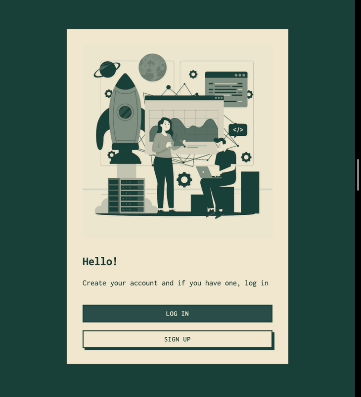
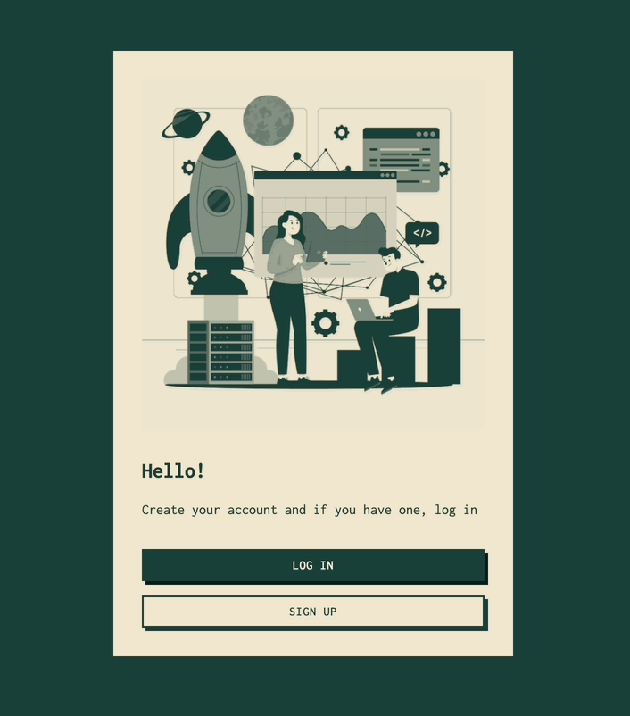

# Chat App Project

This repository consists of two submodules: one for the frontend and one for the backend of the chat application. Below, you'll find setup instructions for each.

## Retro App

Welcome to the **Retro App**! This application provides real-time chat capabilities with both one-on-one and group chat functionalities, integrated with user authentication, notifications, and more.

---

## Project Overview

The **Chat App** is a real-time messaging platform that supports both **one-on-one** and **group chat** functionalities. The app includes features such as user authentication, persistent notifications, room management, and more.

## Project Features:

### 1. **Login and SignUp**

- Users can log in and sign up to access the chat platform.





### 2. **Public Room Chat**

- Users can create and participate in public chat rooms, where anyone can join.


### 2. **Private Room Chat**

- Users can create and participate in private chat rooms, where only allowed participants can join.


### 3. **Retain Chat History**

- Chats are retained for users, allowing them to access previous messages even after refreshing or closing the app.


---

## Cloning the Repo with Submodules

Since this repository contains submodules, you need to clone the repository with the `--recurse-submodules` flag to ensure that the submodules are cloned properly. Follow these steps:

1. **Clone the repo with submodules**:

   ```bash
   git clone --recurse-submodules https://github.com/yourusername/your-repo.git
   ```

2. **Navigate into the project folder**:

   ```bash
   cd your-repo
   ```

3. **If you forgot to clone with the `--recurse-submodules` flag**, you can initialize and update the submodules manually:

   ```bash
   git submodule update --init --recursive
   ```

4. **Pull changes for submodules when updating**:
   When pulling updates, make sure to also update the submodules with:

   ```bash
   git pull --recurse-submodules
   ```

---

## Submodules Setup

### 1. Frontend Setup

The frontend is built using **React**, **Vite**, and **TypeScript**. Detailed setup instructions for the frontend can be found in the frontend submodule's README.

- [Frontend Setup Guide](./frontend/README.md)

### 2. Backend Setup

The backend is powered by **Django** and **Django Channels** for real-time WebSocket communication. For the backend, check out the instructions in its submodule's README.

- [Backend Setup Guide](./backend/README.md)

---

## Running the Entire Application

To run the application, follow the setup steps for both the **backend** and **frontend** as described in their respective READMEs.

### 1. Running the Backend:

Before executing any scripts, ensure the scripts are executable in the terminal.

**Step 1**: Navigate to the backend directory:

```bash
cd backend
```

**Step 2**: Make the scripts executable:

```bash
chmod +x ./scripts/*.sh
```

**Step 3**: Build the Docker image:

```bash
./scripts/build.sh
```

**Step 4**: Start the application:

```bash
./scripts/run.sh
```

**Step 5**: Migrate the database (run this when starting for the first time or after any changes to models) :
Run this in a different terminal and make sure the container are running

```bash
./scripts/migrate.sh
```

The backend will be accessible at:

- Web Application: [http://localhost:8000](http://localhost:8000)
- Admin Interface: [http://localhost:8001/admin](http://localhost:8001/admin)

---

### 2. Running the Frontend

**Step 1**: Navigate to the frontend directory:

```bash
cd frontend
```

**Step 2**: Install the required dependencies:

```bash
npm install
```

**Step 3**: Start the development server:

```bash
npm run dev
```

The frontend will be accessible at: `http://localhost:5173`

---

## Contributing

If you want to contribute, please follow these steps:

1. Fork the repository.
2. Create a feature branch (`git checkout -b feature-name`).
3. Commit your changes (`git commit -m 'Add new feature'`).
4. Push to the branch (`git push origin feature-name`).
5. Open a Pull Request.

---

## 🚀 Best Practices for Commits

- Make **separate commits** for logically different changes.
- Use clear and concise commit messages.
- Follow this format for commit messages: `<type>(<scope>): <subject>`

---

Happy Coding! ✨
